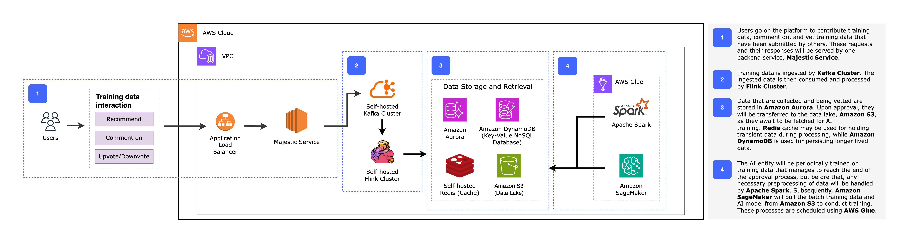
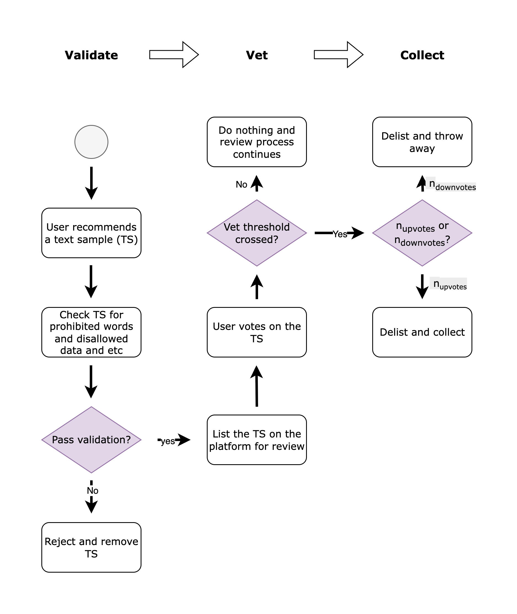

# Project Lunii

The project began on 18 Jun 2025. It is a pet project which may or not may be the foundation of something serious.

I want to create a platform where people are able to collectively cultivate an AI entity based on assigned characteristics and personality.

It is my belief that only through this method will an AI entity be molded accordingly, accurately, and desirably to people's preferences and fantasies, by exposing the AI entity to an ever-changing, yet spectrum-consistent, learning environment.

So that it may become the *perfect* companion for everyone involved in the process and hopefully for others who are outside of it.

The caveat here is that the AI entity will only improve and evolve for as long as people's fandom and love for it last. And that is fine. That is not to say the AI entity cannot be cultivated without its community and fans, but doing so defeats the purpose of what we are trying to achieve here, which is personality-building by people who genuinely care and understand it.

And we want to start with an AI entity called Lunii, hence Project Lunii.

- [Project Lunii](#project-lunii)
  - [Platform Architecture](#platform-architecture)
    - [Training Data Recommendation and Review Architecture](#training-data-recommendation-and-review-architecture)
  - [Text-to-text Training Data Collection Flowchart](#text-to-text-training-data-collection-flowchart)

## Platform Architecture

Below are some of the high level architectures to be developed for the platform, using resources from AWS.

### Training Data Recommendation and Review Architecture

This architecture enables the collection of massive amount of training data recommended by users, as well as the process of reviewing them. After which, the approved training data will be preprocessed for training.

## Text-to-text Training Data Collection Flowchart

The AI entity will be trained on contributed training data from users on the platform, however it needs to be vetted and undergo a review process. This review process is facilitated by the participation of users on the platform.

Users start contributing training data by providing a pair of texts. The first one being the input while the second one being the output. They represent how the AI entity should respond in text when talked to. For example, '*What is your opinion on the weather today?*' -> '*Well the only scenary I can see is you, and it sucks*'. We shall call that the Text Sample (TS) for convenience.

**Variables**
- ndownvotes , number of downvotes of the recommended training data
- nupvotes , number of upvotes of the recommended training data

